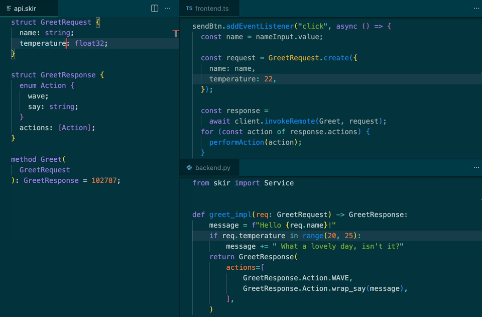

<div align="center">
  <h1>Skir</h1>
  <p><strong>Schema language from the future</strong></p>

  <p>
    <a href="https://skir.build/"><b>skir.build</b></a>
  </p>

  [](https://www.npmjs.com/package/skir)
  [](https://github.com/gepheum/skir/actions)
</div>

<br />

**Skir** is a declarative language for defining data types and APIs.
Write your schema once in a `.skir` file and generate idiomatic, type-safe code in TypeScript, Python, Java, Go, C++, and more.

## 🎬 Quick demo



## ✨ Features

- 🧩 **One schema, 10+ languages, zero headaches** - One YAML config, one command, and watch mode that refreshes generated code on every change.
- 🛡️ **End-to-end type safety** - Shared method and type definitions keep client/server contracts aligned before runtime.
- ⚡ **SkirRPC + Studio** - Lightweight HTTP RPC with a built-in Studio app for browsing and testing methods.
- 📦 **GitHub imports** - Import types directly from GitHub repositories to share data structures across projects.
- 🔁 **Serialization modes** - Dense JSON for APIs/DBs, readable JSON for debugging, and binary for raw performance.
- 🧬 **Polymorphism done right** - Sum types let variants be constants or carry typed payloads for clean, explicit polymorphism.
- 🕰️ **Safe schema evolution** - Built-in checks and clear rules so old and new data remain deserializable.
- 🔒 **Prioritizes immutability** - Skir generates deeply immutable types with all fields required at construction time.
- 🗂️ **Key-indexed arrays** - Declare arrays like `[User|user_id]` and get fast key-based lookup APIs.
- 🛠️ **First-class tooling** - VS Code extension + LSP with validation, completion, and auto-formatting.
- 🧱 **Easy to extend** - Generators are regular NPM modules, so custom generators plug in cleanly.

## ⚡ Syntax example

```d
// robot.skir

enum RobotAction {
  wave;
  say: string;
  goto: Point;
}

struct Point {
  x: int32;
  y: int32;
}

const GREET_ACTIONS: [RobotAction] = [
  "wave",
  {
    kind: "say",
    value: "Hi!",
  },
];

method PerformAction(RobotAction): bool = 12345;
```

Skir compiles these definitions into native, type-safe code you can use in your project:

```python
# my_project.py

from skirout.robot_skir import Point, RobotAction

wave = RobotAction.wave
say_hi = RobotAction.wrap_say("Hi!")
go_to_origin = RobotAction.wrap_goto(Point(x=0, y=0))

# Round-trip serialization to JSON
action_json = RobotAction.serializer.to_json(say_hi)
restored = RobotAction.serializer.from_json(action_json)

assert restored == say_hi
assert go_to_origin.union.kind == "goto"
```

## 📚 Documentation

- [Getting started: setup & workflow](https://skir.build/docs/setup)
- [Language reference](https://skir.build/docs/language-reference)
- [Serialization](https://skir.build/docs/serialization)
- [Schema evolution](https://skir.build/docs/schema-evolution)
- [SkirRPC](https://skir.build/docs/skirrpc)
- [Github imports](https://skir.build/docs/github-imports)
- [Coming from Protocol Buffer](https://skir.build/docs/protobuf)

## 🌍 Supported languages

| Language | Documentation | Example |
| :--- | :--- | :--- |
| 🟦 **TypeScript** | [Documentation](https://skir.build/docs/typescript) | [Example](https://github.com/gepheum/skir-typescript-example) |
| 🐍 **Python** | [Documentation](https://skir.build/docs/python) | [Example](https://github.com/gepheum/skir-python-example) |
| ⚡ **C++** | [Documentation](https://skir.build/docs/cpp) | [Example](https://github.com/gepheum/skir-cc-example) |
| ☕ **Java** | [Documentation](https://skir.build/docs/java) | [Example](https://github.com/gepheum/skir-java-example) |
| #️⃣ **C#** | [Documentation](https://skir.build/docs/csharp) | [Example](https://github.com/gepheum/skir-csharp-example) |
| 💜 **Kotlin** | [Documentation](https://skir.build/docs/kotlin) | [Example](https://github.com/gepheum/skir-kotlin-example) |
| 🦀 **Rust** | [Documentation](https://skir.build/docs/rust) | [Example](https://github.com/gepheum/skir-rust-example) |
| 🐹 **Go** | [Documentation](https://skir.build/docs/go) | [Example](https://github.com/gepheum/skir-go-example) |
| 🎯 **Dart** | [Documentation](https://skir.build/docs/dart) | [Example](https://github.com/gepheum/skir-dart-example) |
| 🐦 **Swift** | [Documentation](https://skir.build/docs/swift) | [Example](https://github.com/gepheum/skir-swift-example) |
| ✨ **Gleam** | [Documentation](https://skir.build/docs/gleam) | [Example](https://github.com/gepheum/skir-gleam-example) |
| ⚡ **Zig** | [Documentation](https://skir.build/docs/zig) | [Example](https://github.com/gepheum/skir-zig-example) |
| 🌙 **MoonBit** | [Documentation](https://skir.build/docs/moonbit) | [Example](https://github.com/gepheum/skir-moonbit-example) |
